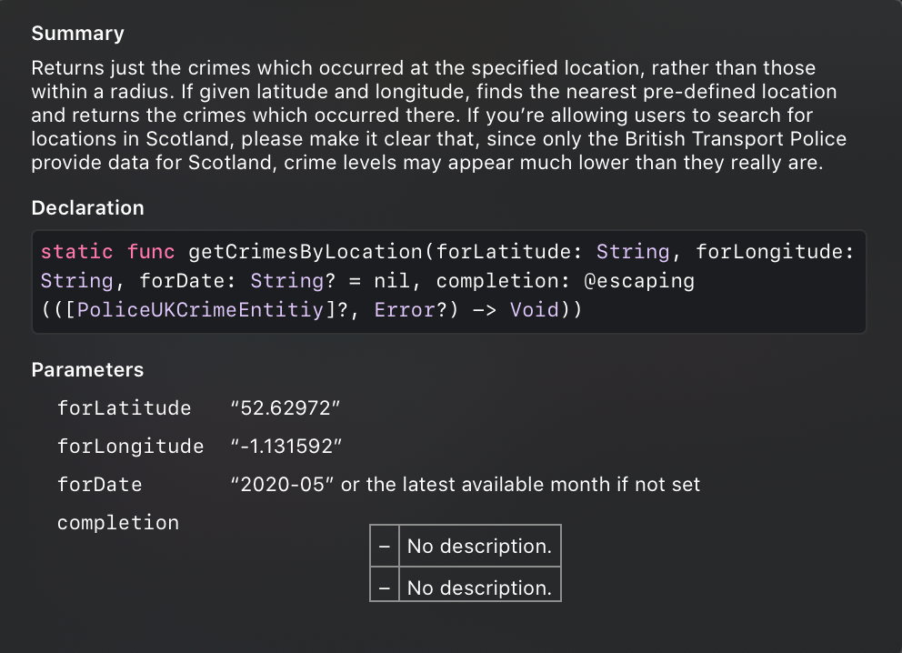

```
  ____       _ _            _   _ _  __                
 |  _ \ ___ | (_) ___ ___  | | | | |/ /                
 | |_) / _ \| | |/ __/ _ \ | | | | ' /                 
 |  __/ (_) | | | (_|  __/ | |_| | . \                 
 |_|   \___/|_|_|\___\___|  \___/|_|\_\                
  _   _      _                      _    _             
 | \ | | ___| |___      _____  _ __| | _(_)_ __   __ _ 
 |  \| |/ _ \ __\ \ /\ / / _ \| '__| |/ / | '_ \ / _` |
 | |\  |  __/ |_ \ V  V / (_) | |  |   <| | | | | (_| |
 |_| \_|\___|\__| \_/\_/ \___/|_|  |_|\_\_|_| |_|\__, |
                                                 |___/ 
```
[](https://cocoapods.org/pods/PoliceUKNetworking)
[](https://cocoapods.org/pods/PoliceUKNetworking)
[](https://cocoapods.org/pods/PoliceUKNetworking)

PoliceUK-Networking was created to wrap an API https://data.police.uk/docs/ into a swift library that could be easily used in any app. 
Licence of the data: [Open Government Licence](https://www.nationalarchives.gov.uk/doc/open-government-licence/version/3/) 

## Installation

PoliceUKNetworking is available through [CocoaPods](https://cocoapods.org). To install it, simply add the following line to your Podfile:

```ruby
pod 'PoliceUKNetworking', '~> 1.0.2'
```

## Requirements

iOS 10.0+

## Example

To run the example project, clone the repo, and run `pod install` from the Example directory first.

Inside you would find all examples of how to use the lib:

```
PoliceUKNetworking.getCrimeDBLaseUpdateDate { response, error in
  print("------------------ getCrimeDBLaseUpdateDate ------------------")
  if let response = response {
    print("response: \(response)")
  }
  if let error = error {
    print("error: \(error)")
  }
}

func getCrimesByLocationForLatLong() {
  PoliceUKNetworking.getCrimesByLocation(forLatitude:"52.629729", forLongitude: "-1.131592") { response, error in
    print("------------------ getCrimesByLocation for Lat/Long ------------------")
    if let response = response {
      print("response: \(response)")
    }
    if let error = error {
      print("error: \(error)")
    }
  }
}
```

#### Also, all methods are documented (option + left click on any method)



## Author

Deniss Kaibagarovs, deniss.kaibagarovs@gmail.com

## License

PoliceUKNetworking is available under the MIT license. See the LICENSE file for more info.
